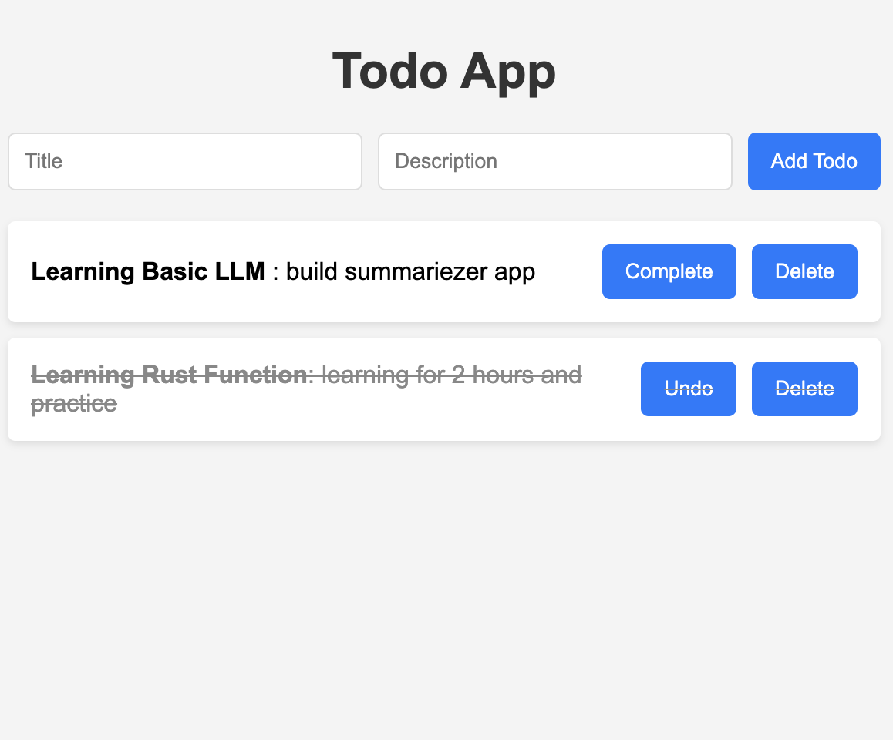

# Todo App in Rust


A simple Todo API built with Rust, Actix-web, and PostgreSQL.

> Try to learn rust by building a simple todo app.

## Prerequisites

- Rust and Cargo
- Docker and Docker Compose

## Getting Started

1. Start the todo-app and PostgreSQL database:

```bash
docker-compose up -d
```

2. The API will be available at http://localhost:8080

## API Endpoints

- `GET /api/todos` - List all todos
- `POST /api/todos` - Create a new todo
- `GET /api/todos/{id}` - Get a specific todo
- `PUT /api/todos/{id}` - Update a todo
- `DELETE /api/todos/{id}` - Delete a todo


## Todo App in Rust

